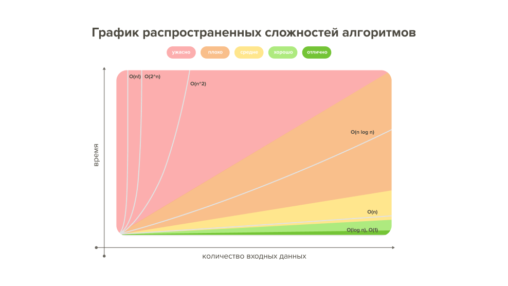

[Вопросы для собеседования](README.md)

Вот краткое описание алгоритмов из предоставленного списка в виде таблицы:

| Раздел | Алгоритм | Описание |
| --- | --- | --- |
| Сортировка | Быстрая сортировка | Эффективный алгоритм сортировки, основанный на разделении массива на две части и рекурсивной сортировке этих частей. |
| Сортировка | Сортировка слиянием | Алгоритм сортировки, основанный на разделении массива на две части, сортировке этих частей и последующем слиянии отсортированных частей. |
| Сортировка | Пузырьковая сортировка | Простой алгоритм сортировки, основанный на последовательном сравнении и обмене соседних элементов. |
| Сортировка | Сортировка вставками | Алгоритм сортировки, основанный на последовательном вставлении элементов в отсортированную часть массива. |
| Сортировка | Сортировка выбором | Алгоритм сортировки, основанный на последовательном выборе наименьшего элемента и перемещении его в начало массива. |
| Сортировка | Сортировка по радиксам | Алгоритм сортировки, основанный на последовательной сортировке по разрядам числа. |
| Поиск | Линейный поиск | Простой алгоритм поиска, основанный на последовательном просмотре всех элементов массива. |
| Поиск | Бинарный поиск | Эффективный алгоритм поиска, основанный на последовательном делении массива пополам. |
| Поиск | Поиск в глубину (DFS) | Алгоритм обхода графа, основанный на последовательном посещении всех вершин, начиная с одной из них. |
| Поиск | Поиск в ширину (BFS) | Алгоритм обхода графа, основанный на последовательном посещении всех вершин, начиная с одной из них, с учетом расстояния от начальной вершины. |
| Рекурсия | Рекурсивные функции | Функции, которые вызывают сами себя для решения задачи. |
| Рекурсия | Упрощение рекурсии (хвостовая рекурсия) | Оптимизация рекурсивных функций, основанная на использовании последнего вызова функции. |
| Динамическое программирование | Задача о рюкзаке | Классическая задача динамического программирования, связанная с оптимальным заполнением рюкзака. |
| Хэширование | Хэш-таблицы | Структура данных, основанная на использовании хэш-функций для быстрого доступа к элементам. |
| Хэширование | Конфликты хэширования | Ситуации, когда две разные ключи отображаются в одну и ту же ячейку хэш-таблицы. |
| Хэширование | Классические хэш-функции | Функции, используемые для преобразования ключей в индексы ячеек хэш-таблицы. |
| Деревья | Двоичное дерево | Древовидная структура данных, в которой каждый узел имеет не более двух дочерних узлов. |
| Деревья | Двоичное дерево поиска

## Big O Notation



Вот краткая таблица с информацией о различных видах сложности алгоритмов:

| Сложность | Описание | Признаки |
| --- | --- | --- |
| Константная: O(1) | Время выполнения алгоритма не зависит от размера входных данных. | Выполнение фиксированного количества операций. |
| Линейная: O(n) | Время выполнения алгоритма линейно зависит от размера входных данных. | Выполнение операций, количество которых пропорционально размеру входных данных. |
| Логарифмическая: O(log n) | Время выполнения алгоритма логарифмически зависит от размера входных данных. | Разделение входных данных на части и последовательная обработка этих частей. |
| Линейно-логарифмическая: O(n log n) | Время выполнения алгоритма зависит от размера входных данных и их логарифма. | Сочетание линейных и логарифмических операций. |
| Квадратичная: O(n^2) | Время выполнения алгоритма квадратично зависит от размера входных данных. | Вложенные циклы, где количество операций пропорционально квадрату размера входных данных. |
| Экспоненциальная: O(2^n) | Время выполнения алгоритма экспоненциально зависит от размера входных данных. | Рекурсивные алгоритмы с экспоненциальным ростом количества вызовов. |
| Факториальная: O(n!) | Время выполнения алгоритма факториально зависит от размера входных данных. | Алгоритмы, где количество операций пропорционально факториалу размера входных данных. |

### Константная сложность: O(1)
Вот пример признаков константной сложности O(1) на языке Java:

```java
// Константная сложность: O(1)
public int addNumbers(int a, int b) {
    return a + b;
}

// Константная сложность: O(1)
public boolean isEven(int number) {
    return number % 2 == 0;
}

// Константная сложность: O(1)
public void printHelloWorld() {
    System.out.println("Hello, World!");
}

// Константная сложность: O(1)
public int getFirstElementFromArray(int[] arr) {
    return arr[0];
}
```

Признаки константной сложности O(1) в Java:

1. **Выполнение фиксированного количества операций**: Независимо от размера входных данных, алгоритм выполняет одно и то же количество операций. Например, сложение двух чисел, проверка на четность, вывод строки на экран, получение первого элемента массива.
2. **Отсутствие циклов или рекурсии**: Алгоритм не содержит циклов или рекурсивных вызовов, которые могли бы зависеть от размера входных данных.
3. **Доступ к элементам с постоянным индексом**: Алгоритм обращается к элементам данных с фиксированными индексами, а не с индексами, зависящими от размера входных данных.
4. **Выполнение операций с константным временем**: Все операции, выполняемые алгоритмом, имеют константное время выполнения, не зависящее от размера входных данных.

Эти признаки позволяют определить, что алгоритм имеет константную сложность O(1) в Java.

### Логарифмическая сложность: O(log n)
Вот пример признаков логарифмической сложности O(log n) на языке Java:

```java
// Логарифмическая сложность: O(log n)
public int binarySearch(int[] arr, int target) {
    int left = 0;
    int right = arr.length - 1;

    while (left <= right) {
        int mid = left + (right - left) / 2;
        if (arr[mid] == target) {
            return mid;
        } else if (arr[mid] < target) {
            left = mid + 1;
        } else {
            right = mid - 1;
        }
    }

    return -1;
}

// Логарифмическая сложность: O(log n)
public int findPowerOfTwo(int n) {
    int power = 0;
    while ((1 << power) < n) {
        power++;
    }
    return power;
}

// Логарифмическая сложность: O(log n)
public void printPowersOfTwo(int n) {
    for (int i = 0; i <= log2(n); i++) {
        System.out.println(1 << i);
    }
}

private int log2(int n) {
    return (int) (Math.log(n) / Math.log(2));
}
```

Признаки логарифмической сложности O(log n) в Java:

1. **Разделение входных данных на части**: Алгоритм последовательно делит входные данные на две части, обрабатывая только одну из них на каждом шаге. Например, бинарный поиск, поиск степени двойки.
2. **Использование операций с логарифмической сложностью**: Алгоритм использует операции, время выполнения которых растет логарифмически с размером входных данных. Например, вычисление логарифма по основанию 2.
3. **Отсутствие вложенных циклов**: Алгоритм не содержит вложенных циклов, которые могли бы увеличить сложность до линейной или квадратичной.
4. **Сокращение размера входных данных на каждом шаге**: На каждой итерации алгоритм уменьшает размер входных данных, которые необходимо обработать, примерно вдвое. Это приводит к логарифмической зависимости времени выполнения от размера входных данных.

Эти признаки позволяют определить, что алгоритм имеет логарифмическую сложность O(log n) в Java.

### Линейная сложность: O(n)
Вот пример признаков линейной сложности O(n) на языке Java:

```java
// Линейная сложность: O(n)
public int sumOfElements(int[] arr) {
    int sum = 0;
    for (int i = 0; i < arr.length; i++) {
        sum += arr[i];
    }
    return sum;
}

// Линейная сложность: O(n)
public boolean containsElement(int[] arr, int target) {
    for (int i = 0; i < arr.length; i++) {
        if (arr[i] == target) {
            return true;
        }
    }
    return false;
}

// Линейная сложность: O(n)
public void printArray(int[] arr) {
    for (int i = 0; i < arr.length; i++) {
        System.out.println(arr[i]);
    }
}

// Линейная сложность: O(n)
public int[] reverseArray(int[] arr) {
    int left = 0;
    int right = arr.length - 1;
    while (left < right) {
        int temp = arr[left];
        arr[left] = arr[right];
        arr[right] = temp;
        left++;
        right--;
    }
    return arr;
}
```

Признаки линейной сложности O(n) в Java:

1. **Выполнение операций, количество которых пропорционально размеру входных данных**: Алгоритм выполняет операции, количество которых линейно зависит от размера входных данных. Например, итерация по массиву, поиск элемента в массиве, вывод элементов массива.
2. **Наличие одного цикла, зависящего от размера входных данных**: Алгоритм содержит один цикл, где количество итераций пропорционально размеру входных данных. Например, цикл for или while, проходящий по всем элементам массива.
3. **Отсутствие вложенных циклов или рекурсии**: Алгоритм не содержит вложенных циклов или рекурсивных вызовов, которые могли бы увеличить сложность до квадратичной или экспоненциальной.
4. **Выполнение операций с константным временем**: Все операции, выполняемые внутри цикла, имеют константное время выполнения, не зависящее от размера входных данных.

Эти признаки позволяют определить, что алгоритм имеет линейную сложность O(n) в Java.

### Линейно-логарифмическая сложность: O(n log n)
Вот пример признаков линейно-логарифмической сложности O(n log n) на языке Java:

```java
// Линейно-логарифмическая сложность: O(n log n)
public void mergeSort(int[] arr) {
    if (arr.length > 1) {
        int mid = arr.length / 2;
        int[] left = new int[mid];
        int[] right = new int[arr.length - mid];

        for (int i = 0; i < mid; i++) {
            left[i] = arr[i];
        }
        for (int i = mid; i < arr.length; i++) {
            right[i - mid] = arr[i];
        }

        mergeSort(left);
        mergeSort(right);

        merge(arr, left, right);
    }
}

private void merge(int[] arr, int[] left, int[] right) {
    int i = 0, j = 0, k = 0;
    while (i < left.length && j < right.length) {
        if (left[i] <= right[j]) {
            arr[k++] = left[i++];
        } else {
            arr[k++] = right[j++];
        }
    }
    while (i < left.length) {
        arr[k++] = left[i++];
    }
    while (j < right.length) {
        arr[k++] = right[j++];
    }
}

// Линейно-логарифмическая сложность: O(n log n)
public void quickSort(int[] arr, int left, int right) {
    if (left < right) {
        int pivotIndex = partition(arr, left, right);
        quickSort(arr, left, pivotIndex - 1);
        quickSort(arr, pivotIndex + 1, right);
    }
}

private int partition(int[] arr, int left, int right) {
    int pivot = arr[right];
    int i = left - 1;
    for (int j = left; j < right; j++) {
        if (arr[j] < pivot) {
            i++;
            swap(arr, i, j);
        }
    }
    swap(arr, i + 1, right);
    return i + 1;
}

private void swap(int[] arr, int i, int j) {
    int temp = arr[i];
    arr[i] = arr[j];
    arr[j] = temp;
}
```

Признаки линейно-логарифмической сложности O(n log n) в Java:

1. **Разделение входных данных на части**: Алгоритм последовательно делит входные данные на части, обрабатывая каждую часть отдельно. Например, в алгоритме сортировки слиянием (Merge Sort) и быстрой сортировке (Quick Sort).
2. **Использование операций с логарифмической сложностью**: Алгоритм использует операции, время выполнения которых растет логарифмически с размером входных данных. Например, рекурсивные вызовы в алгоритмах сортировки.
3. **Выполнение операций, количество которых пропорционально размеру входных данных**: Алгоритм выполняет операции, количество которых линейно зависит от размера входных данных. Например, итерация по массиву при слиянии или разделении.
4. **Отсутствие вложенных циклов с линейной сложностью**: Алгоритм не содержит вложенных циклов, которые могли бы увеличить сложность до квадратичной.

Эти признаки позволяют определить, что алгоритм имеет линейно-логарифмическую сложность O(n log n) в Java.

### Квадратичная сложность: O(n^2)
Вот пример признаков квадратичной сложности O(n^2) на языке Java:

```java
// Квадратичная сложность: O(n^2)
public void bubbleSort(int[] arr) {
    int n = arr.length;
    for (int i = 0; i < n - 1; i++) {
        for (int j = 0; j < n - i - 1; j++) {
            if (arr[j] > arr[j + 1]) {
                // Swap arr[j] and arr[j+1]
                int temp = arr[j];
                arr[j] = arr[j + 1];
                arr[j + 1] = temp;
            }
        }
    }
}

// Квадратичная сложность: O(n^2)
public int[] twoSum(int[] nums, int target) {
    for (int i = 0; i < nums.length; i++) {
        for (int j = i + 1; j < nums.length; j++) {
            if (nums[i] + nums[j] == target) {
                return new int[] { i, j };
            }
        }
    }
    return new int[] { -1, -1 };
}

// Квадратичная сложность: O(n^2)
public int[][] multiplyMatrices(int[][] matrix1, int[][] matrix2) {
    int rows1 = matrix1.length;
    int cols1 = matrix1[0].length;
    int cols2 = matrix2[0].length;

    int[][] result = new int[rows1][cols2];

    for (int i = 0; i < rows1; i++) {
        for (int j = 0; j < cols2; j++) {
            for (int k = 0; k < cols1; k++) {
                result[i][j] += matrix1[i][k] * matrix2[k][j];
            }
        }
    }

    return result;
}
```

Признаки квадратичной сложности O(n^2) в Java:

1. **Наличие вложенных циклов, зависящих от размера входных данных**: Алгоритм содержит два вложенных цикла, где количество итераций каждого цикла пропорционально размеру входных данных. Например, в алгоритме сортировки пузырьком (Bubble Sort) и в алгоритме поиска пары чисел, сумма которых равна заданному значению (Two Sum).
2. **Выполнение операций, количество которых пропорционально квадрату размера входных данных**: Алгоритм выполняет операции, количество которых квадратично зависит от размера входных данных. Например, умножение матриц.
3. **Отсутствие оптимизаций, которые могли бы снизить сложность**: Алгоритм не использует никаких оптимизаций, которые могли бы уменьшить количество выполняемых операций, например, разделение входных данных на части.
4. **Выполнение операций с константным временем**: Все операции, выполняемые внутри вложенных циклов, имеют константное время выполнения, не зависящее от размера входных данных.

Эти признаки позволяют определить, что алгоритм имеет квадратичную сложность O(n^2) в Java.

### Экспоненциальная сложность: O(2^n)
Вот пример признаков экспоненциальной сложности O(2^n) на языке Java:

```java
// Экспоненциальная сложность: O(2^n)
public int fibonacci(int n) {
    if (n <= 1) {
        return n;
    }
    return fibonacci(n - 1) + fibonacci(n - 2);
}

// Экспоненциальная сложность: O(2^n)
public List<List<Integer>> subsets(int[] nums) {
    List<List<Integer>> result = new ArrayList<>();
    backtrack(result, new ArrayList<>(), nums, 0);
    return result;
}

private void backtrack(List<List<Integer>> result, List<Integer> tempList, int[] nums, int start) {
    result.add(new ArrayList<>(tempList));
    for (int i = start; i < nums.length; i++) {
        tempList.add(nums[i]);
        backtrack(result, tempList, nums, i + 1);
        tempList.remove(tempList.size() - 1);
    }
}

// Экспоненциальная сложность: O(2^n)
public List<String> generateParenthesis(int n) {
    List<String> result = new ArrayList<>();
    backtrack(result, "", 0, 0, n);
    return result;
}

private void backtrack(List<String> result, String current, int open, int close, int max) {
    if (current.length() == max * 2) {
        result.add(current);
        return;
    }

    if (open < max) {
        backtrack(result, current + "(", open + 1, close, max);
    }
    if (close < open) {
        backtrack(result, current + ")", open, close + 1, max);
    }
}
```

Признаки экспоненциальной сложности O(2^n) в Java:

1. **Использование рекурсии с экспоненциальным ростом вызовов**: Алгоритм использует рекурсивные вызовы, где количество вызовов растет экспоненциально с размером входных данных. Например, в алгоритмах вычисления чисел Фибоначчи и генерации всех подмножеств.
2. **Наличие ветвлений, где каждое ветвление удваивает количество вариантов**: Алгоритм содержит ветвления, где на каждом шаге количество вариантов удваивается. Например, в алгоритме генерации всех возможных комбинаций скобок.
3. **Отсутствие оптимизаций, которые могли бы снизить сложность**: Алгоритм не использует никаких оптимизаций, которые могли бы уменьшить количество выполняемых операций, например, мемоизацию или динамическое программирование.
4. **Выполнение операций с константным временем**: Все операции, выполняемые внутри рекурсивных вызовов, имеют константное время выполнения, не зависящее от размера входных данных.

Эти признаки позволяют определить, что алгоритм имеет экспоненциальную сложность O(2^n) в Java.

### Факториальная сложность: O(n!)
Вот пример признаков факториальной сложности O(n!) на языке Java:

```java
// Факториальная сложность: O(n!)
public List<List<Integer>> permute(int[] nums) {
    List<List<Integer>> result = new ArrayList<>();
    backtrack(result, new ArrayList<>(), nums);
    return result;
}

private void backtrack(List<List<Integer>> result, List<Integer> tempList, int[] nums) {
    if (tempList.size() == nums.length) {
        result.add(new ArrayList<>(tempList));
    } else {
        for (int i = 0; i < nums.length; i++) {
            if (tempList.contains(nums[i])) continue;
            tempList.add(nums[i]);
            backtrack(result, tempList, nums);
            tempList.remove(tempList.size() - 1);
        }
    }
}

// Факториальная сложность: O(n!)
public List<List<Integer>> combinationSum(int[] candidates, int target) {
    List<List<Integer>> result = new ArrayList<>();
    backtrack(result, new ArrayList<>(), candidates, target, 0);
    return result;
}

private void backtrack(List<List<Integer>> result, List<Integer> tempList, int[] candidates, int remain, int start) {
    if (remain < 0) {
        return;
    } else if (remain == 0) {
        result.add(new ArrayList<>(tempList));
    } else {
        for (int i = start; i < candidates.length; i++) {
            tempList.add(candidates[i]);
            backtrack(result, tempList, candidates, remain - candidates[i], i);
            tempList.remove(tempList.size() - 1);
        }
    }
}
```

Признаки факториальной сложности O(n!) в Java:

1. **Использование рекурсии с факториальным ростом вызовов**: Алгоритм использует рекурсивные вызовы, где количество вызовов растет факториально с размером входных данных. Например, в алгоритмах генерации всех перестановок и комбинаций.
2. **Наличие вложенных циклов, где количество итераций пропорционально факториалу размера входных данных**: Алгоритм содержит вложенные циклы, где количество итераций каждого цикла пропорционально размеру входных данных. Например, в алгоритме генерации всех перестановок.
3. **Отсутствие оптимизаций, которые могли бы снизить сложность**: Алгоритм не использует никаких оптимизаций, которые могли бы уменьшить количество выполняемых операций, например, мемоизацию или динамическое программирование.
4. **Выполнение операций с константным временем**: Все операции, выполняемые внутри рекурсивных вызовов и вложенных циклов, имеют константное время выполнения, не зависящее от размера входных данных.

Эти признаки позволяют определить, что алгоритм имеет факториальную сложность O(n!) в Java.

## Сортировка
### Быстрая сортировка

Конечно! Алгоритм Быстрой сортировки (QuickSort) - это эффективный алгоритм сортировки, основанный на принципе "разделяй и властвуй". Давайте разберем его подробно:

Суть алгоритма:
1. Выбирается опорный элемент (pivot) из массива
2. Массив разбивается на две части:
    - элементы меньше опорного
    - элементы больше опорного
3. Каждая из частей рекурсивно сортируется тем же методом

Вот пошаговое описание алгоритма:

1. **Выбор опорного элемента**
    - Обычно берется последний или средний элемент массива
    - От правильного выбора опорного элемента зависит эффективность сортировки

2. **Разделение массива**
    - Элементы перемещаются так, чтобы слева были меньше опорного
    - Справа - больше опорного
    - Сам опорный элемент помещается на свое окончательное место

3. **Рекурсивная сортировка**
    - Левая и правая части массива сортируются теми же шагами
    - Рекурсия продолжается, пока не останутся подмассивы из одного элемента

**Преимущества QuickSort:**
- Средняя сложность O(n log n)
- Эффективен для больших массивов
- Работает "на месте" (не требует дополнительной памяти)

**Недостатки:**
- Худший случай - O(n²), если выбор опорного элемента неудачный
- Нестабильный алгоритм (может менять порядок равных элементов)

Надеюсь, это поможет вам понять алгоритм Быстрой сортировки!


```java
package com.ki.algorithms;

import java.util.Arrays;

public class QuickSort {
    public static void main(String[] args) {
        //int[] array = new int[]{9, 3, 11, 2, 6, 1, 90, 18, 22};
        int[] array = new int[]{10, 7, 8, 9, 1, 5};
        quickSort(array, 0, array.length - 1);
        System.out.println("Отсортированный массив: " + Arrays.toString(array));
        for (int num : array) {
            System.out.print(num + " ");
        }
    }

    private static void quickSort(int[] array, int low, int high) {
        if (low < high) {
            // Определить индекс опорного элемента
            int pivotIndex = partition(array, low, high);

            // Рекурсивная сортировка левой части
            quickSort(array, low, pivotIndex - 1);
            // Рекурсивная сортировка правой части
            quickSort(array, pivotIndex + 1, high);
        }
    }

    private static int partition(int[] array, int low, int high) {
        // Выбор опорного элемента (например, последний элемент)
        int pivot = array[high];
        int i = low - 1; // Индекс для элемента, меньшего, чем pivot

        for (int j = low; j < high; j++) {
            if (array[j] < pivot) {
                i++;
                // Обмен элементов
                swap(array, i, j);
            }
        }

        // Поместить опорный элемент на его место
        swap(array, i + 1, high);
        return i + 1;
    }

    private static void swap(int[] array, int i, int j) {
        int temp = array[i];
        array[i] = array[j];
        array[j] = temp;
    }
}
```

### Сортировка слиянием
### Пузырьковая сортировка
### Сортировка вставками
### Сортировка выбором
### Сортировка по радиксам

## Поиск
### Линейный поиск
### Бинарный поиск
### Поиск в глубину (DFS)
### Поиск в ширину (BFS)

## Рекурсия
### Рекурсивные функции
### Упрощение рекурсии (хвостовая рекурсия)

## Динамическое программирование
### Задача о рюкзаке

## Хэширование
### Хэш-таблицы
### Конфликты хэширования
### Классические хэш-функции

## Деревья
### Двоичное дерево
### Двоичное дерево поиска
### AVL-деревья
### Красно-черные деревья
### B-деревья


## Множества
### Битовые множества
### Множества на основе хэширования

## Кучи
### Мин-куча
### Макс-куча